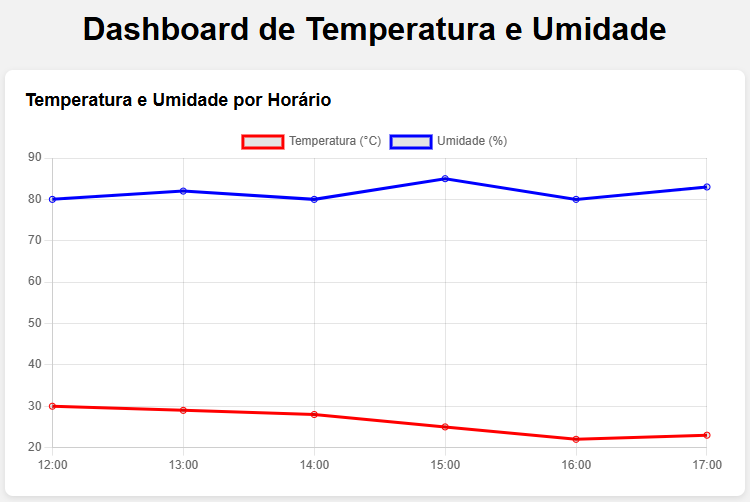
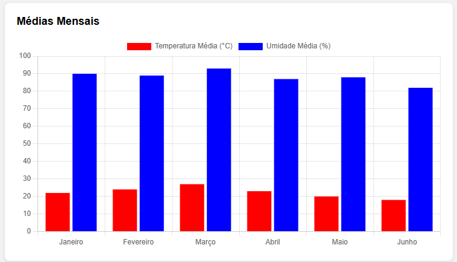

# graficos-de-temperatura-e-umidade

Repositório dedicado à utilização da biblioteca Chart.js para a disciplina de Pesquisa e Inovação, com o intuito de exibir um gráfico de linha e um de barras.

## Como abrir

1. Clone este repositório.
2. Abra o arquivo `src/index.html` no navegador.

> É preciso estar conectado à internet.

## Resultado do Projeto

## Tecnologias

- HTML
- CSS
- JavaScript
- Chart.js
